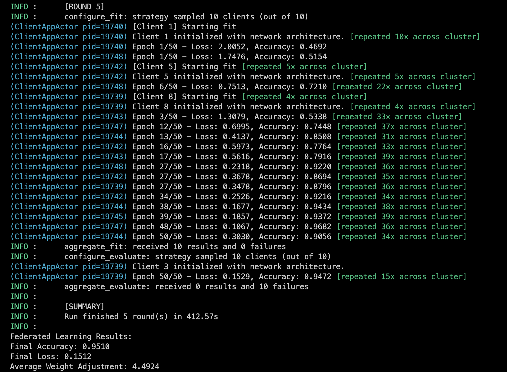
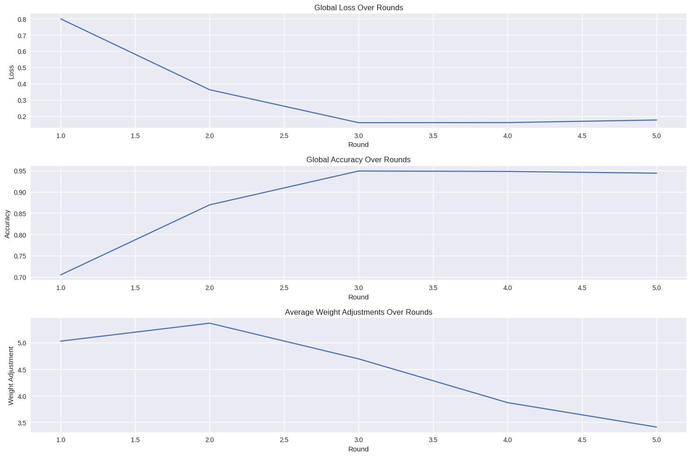

[](https://github.com/iababio/federated_xai_blockchain/actions/workflows/python-app.yml)

# Federated Learning with Explainable AI and Blockchain Integration

## Project Overview

This project implements a federated learning framework that integrates explainable AI (XAI) techniques and blockchain technology. The goal is to train machine learning models collaboratively across multiple clients while ensuring data privacy and providing insights into model decisions.

## Table of Contents

1. [Prerequisites](#prerequisites)
2. [Installation](#installation)
3. [Project Structure](#project-structure)
4. [Usage](#usage)
5. [Running the Simulation](#running-the-simulation)
6. [Results and Visualization](#results-and-visualization)
7. [Contributing](#contributing)
8. [License](#license)

## Prerequisites

Before you begin, ensure you have met the following requirements:

- Python 3.10 or higher
- pip (Python package installer)
- A local or cloud-based environment with GPU support (optional but recommended for training)

## Installation

1. Clone the repository:

   ```bash
   git clone https://github.com/iababio/federated_xai_blockchain.git
   cd fedXaiBlockChain
   ```

2. Install the required packages:

   ```bash
   pip install -r requirements.txt
   ```

3. Ensure you have an Ethereum node running (e.g., Ganache) to interact with the blockchain. Update the `blockchain.py` file with the correct provider URL all necessary credential.

## Project Structure

The project is organized as follows:

```
__init__.py
data/                          # folder to store data
images/                        # folder to store visualizations
requirements.txt               # requirements
readme.md
main.py                        # Entry point for the application
src/
    ├── model.py               # Neural network architecture
    ├── client.py              # Federated client implementation
    ├── strategy.py            # Federated learning strategy
    ├── data_loaders.py        # call load data from utils 
    ├── utils.py               # Utility functions for data loading and training
    ├── visualization.py       # Functions for plotting and visualizing results
    └── blockchain.py          # Blockchain interaction logic

```

## Usage

1. **Data Loading**: The CIFAR-10 dataset is used for training. The dataset is automatically downloaded and preprocessed when you run the application.

2. **Model Training**: The model is trained using federated learning, where each client trains on its local data and shares model updates with a central server.

3. **Explainable AI**: The project integrates LIME (Local Interpretable Model-agnostic Explanations) to provide insights into model predictions.

4. **Blockchain Integration**: The model updates can be recorded on a blockchain for transparency and traceability.

## Running the Simulation

To run the federated learning simulation, execute the following command:

```bash
python main.py
```

This will start the federated learning process, where multiple clients will train the model and share their updates.



## Results and Visualization

After the simulation completes, results will be printed to the console, including final accuracy, loss, and average weight adjustments. Additionally, plots will be saved in the `images` directory:

- **Saliency Maps**: Visualizations of model predictions and their explanations.
- **Weight Adjustments**: Histograms showing changes in model weights.
- **Federated Learning Metrics**: Plots of global loss, accuracy, and weight adjustments over training rounds.

You can find the saved images in the `images` folder.




## Contributing

Contributions are welcome! If you have suggestions for improvements or new features, please fork the repository and submit a pull request.

## License

This project is licensed under the MIT License. See the LICENSE file for more details.

---

Feel free to use, modify or contribute to any sections to better fit your project's specifics or to add additional details as needed!
